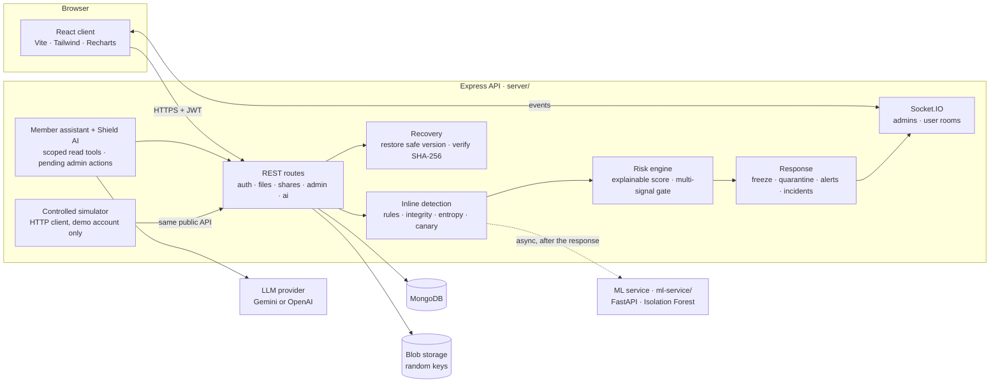

# ShieldShare

**Secure file sharing with ransomware-like activity detection, containment and recovery.**

ShieldShare is a file-sharing workspace that watches how files change. Every upload, change,
rename, move and delete is recorded with its SHA-256 hash and entropy. Each write is scored
inside the request over a sliding window of the user's activity. When a burst of changes looks
like encryption in progress, ShieldShare explains the score signal by signal, freezes the
account, quarantines the affected files, and restores the last versions from before the burst
started. Administrators investigate with a live dashboard and Shield AI, an assistant that
answers from the stored evidence and can only propose actions for an administrator to confirm.

It is a hackathon project. See [Limitations](#limitations).

## Architecture



| Layer | Role |
|-------|------|
| Detection | Rules over a 60 s window (rapid activity, mass modification/rename/delete, directory spread, extension changes), SHA-256 change ratio, entropy increase on low-entropy files, hidden canary files |
| ML | Isolation Forest anomaly signal, asynchronous and auxiliary: it can only raise a severity, and detection works the same when it is down |
| Risk | Sum of fired signals, each with observed value, threshold and points; fewer than two signal categories cannot reach Critical |
| Response | High opens an incident; Critical also freezes the account (read-only) and quarantines the affected files and their share links |
| Recovery | Restore the last version from before the incident as a new version, original name back, SHA-256 verified, links reactivated |
| AI | Members can ask about their own workspace; administrators investigate security evidence. Both use service-scoped tools, and admin action proposals wait for confirmation |

## Tech stack

- **Client:** React 19, Vite, Tailwind CSS 4, React Router 7, Axios, Socket.IO client, Recharts
- **API:** Node.js 20.12+ (developed on 24), Express 5, Mongoose 9, Zod, Multer, Socket.IO, Helmet, express-rate-limit
- **Database:** MongoDB 7+ (developed on 8.0)
- **ML service:** Python 3.12, FastAPI, scikit-learn (Isolation Forest), trained on synthetic data
- **Shield AI:** Google Gemini (`@google/genai`) or OpenAI (`openai`), selected by `AI_PROVIDER`
- **Tests:** `node:test`, supertest, mongodb-memory-server, socket.io-client, pytest

## Setup on a clean machine

Prerequisites: Node.js 20.12+, a local MongoDB listening on `127.0.0.1:27017`, and Python 3.12
for the optional ML service.

```powershell
# 1. API
cd server
npm install
copy .env.example .env        # then fill it in (see below)
npm run seed                  # configured accounts + realistic multi-user demo dataset

# 2. Client
cd ..\client
npm install
copy .env.example .env        # VITE_API_URL=http://localhost:5000

# 3. ML service (optional; detection works without it)
cd ..\ml-service
py -3.12 -m venv .venv
.venv\Scripts\python.exe -m pip install -r requirements.txt
.venv\Scripts\python.exe generate_synthetic.py
.venv\Scripts\python.exe train.py
```

On macOS or Linux use `cp` and `.venv/bin/python`.

### Environment variables (`server/.env`)

`server/.env.example` lists every variable with comments. The ones to fill in:

| Variable | Purpose |
|----------|---------|
| `MONGO_URI` | e.g. `mongodb://127.0.0.1:27017/shieldshare_dev` |
| `JWT_SECRET` | 32+ random characters |
| `CLIENT_ORIGIN` | `http://localhost:5173` (CORS allows exactly this origin) |
| `SEED_ADMIN_*`, `SEED_USER_*` | Configured accounts; `SEED_USER_PASSWORD` is also used by the fictional `@shieldshare.demo` users |
| `AI_PROVIDER`, `GEMINI_API_KEY` or `OPENAI_API_KEY` | Shield AI. Without a key it reports "unavailable" and nothing else changes |
| `ML_ENABLED`, `ML_SERVICE_URL` | The anomaly service (default `http://127.0.0.1:8000`) |
| `SIMULATOR_ENABLED`, `SIMULATOR_DEMO_USER_EMAIL`, `SIMULATOR_DEMO_USER_PASSWORD` | The controlled simulator. Use a dedicated demo address: its reset deletes that account's files. Must stay `false` outside local demos (the server refuses to start with it enabled in production) |

Secrets stay server-side. The client only receives `VITE_API_URL`.

### Seeded demonstration accounts

`npm run seed` is idempotent and leaves existing account passwords unchanged. In addition to
the configured `SEED_ADMIN_EMAIL` and `SEED_USER_EMAIL`, it creates the following fictional
users. They all sign in with the value of `SEED_USER_PASSWORD`; the password itself is never
stored in source or printed.

| Account | Demonstrates |
|---------|--------------|
| `maya.chen@shieldshare.demo` | Healthy workspace |
| `liam.patel@shieldshare.demo` | Recent uploads and downloads |
| `sofia.martinez@shieldshare.demo` | Active and expiring share links |
| `noah.williams@shieldshare.demo` | Multiple folders and file formats |
| `ava.thompson@shieldshare.demo` | Security alert without an incident |
| `ethan.brooks@shieldshare.demo` | Contained incident and frozen account |
| `priya.shah@shieldshare.demo` | Restored, verified, resolved incident |
| `lucas.meyer@shieldshare.demo` | Active, expiring, expired, and revoked links |

The dataset contains PDF, DOCX, XLSX, PPTX, TXT, CSV, ZIP, and PNG files, real activity
records, usable share links, stored risk evaluations, quarantine records, and recovery
history. Seeded incidents are produced through the existing detection and recovery services;
dashboard totals and charts continue to come from database records.

## Running

One command from the repository root starts the ML service, the API and the web client, waits
for each to answer, and stops all three on Ctrl+C:

```powershell
node scripts/start-demo.mjs               # everything
node scripts/start-demo.mjs --simulator   # also enables the simulator for this run
node scripts/start-demo.mjs --no-ml       # without the ML service
```

Or separately: `cd server && npm run dev`, `cd client && npm run dev`, and in `ml-service/`
`.venv\Scripts\python.exe -m uvicorn app:app --host 127.0.0.1 --port 8000`.

The app is at http://localhost:5173 and the API at http://localhost:5000.

### Commands

```powershell
cd server
npm run seed                 # idempotent: accounts, populated workspaces, lifecycle data, canaries
npm run canaries:backfill    # canary files for accounts created before Phase 3
npm run sim:reset            # simulator (API must be running with SIMULATOR_ENABLED=true)
npm run sim:seed
npm run sim:run              # add -- --wait to wait until seeded files leave the window
npm test                     # unit + all integration suites
npm run test:detection       # unit + Phase 3
npm run test:realtime        # unit + Phase 4

cd ..\ml-service
.venv\Scripts\python.exe -m pytest
```

## Demo script (spec §31)

About five minutes. Two browser windows: the admin dashboard (`/admin`) and the demo account
(a private window, `/app/files`).

**Before the demo**

1. `node scripts/start-demo.mjs --simulator` (MongoDB running, `npm run seed` done).
2. Admin → **Simulator** → **Reset demo workspace**. Wait until the simulator page no longer
   shows "Ready in …" (the seeded files must be older than the 60-second detection window so
   recovery has a version from before the burst).
3. Check the dashboard says **SYSTEM PROTECTED** and the ML status is `ok` (or be ready to say
   "ML unavailable; deterministic detection still contains it").

**During the demo**

1. **Normal upload** (demo account, Files): upload 3–5 files. Each shows its SHA-256 and
   version 1; the admin live feed shows them as Safe.
2. **Secure sharing**: open a file → Sharing → Create link (download, 7 days). Open the link in
   another window to show it works.
3. **Controlled simulation** (admin, Simulator): Run scenario → ransomware-like. Point out the
   label: demo account only, reversible transform, no real ransomware. Do steps 1–2 at least a
   minute before this step, or the files just uploaded will have no pre-burst version.
4. **Detection**: the progress log stops with "Stopped: account frozen after N operations"
   within a few seconds; a toast links to the incident. On the incident page show the risk
   breakdown: behavior rules, SHA-256 change, entropy, ML anomaly, and the canary if the burst
   reached it.
5. **Containment**: the demo account's window shows the frozen banner and files "Under
   review"; the share link now says it is unavailable.
6. **Investigation**: ask Shield AI on the incident page: "Why was this account frozen?",
   "Which files were affected?", "Explain the risk score."
7. **Recovery**: Start investigation → Restore all → the incident becomes Recovered with
   SHA-256 verified for every file; Resolve (and unfreeze). The demo account's files have their
   names back and the share link works again.

Measured in the Phase 6 acceptance runs (default pace 150 ms, ML service up): frozen after 15 of
38 planned operations, about 2.7 s from the simulator's first write, peak risk 80 (Critical).

**If something fails live**

- *Shield AI unavailable or slow*: the provider may be overloaded or out of quota. Say so, and
  show the incident page's stored risk breakdown and evidence, which the assistant reads from.
- *ML service down*: the incident still reaches Critical; the breakdown shows "ML service
  unavailable, deterministic detection unaffected". That is the design.
- *"Run scenario" is disabled*: the seeded files are still inside the detection window; the
  page shows the remaining seconds.
- *Anything else*: Reset, wait for "Ready", and run again; a run takes under ten seconds.

## Repository layout

```text
Shieldshare/
├── client/            React app (pages, features, components, state)
├── server/            Express API (spec §27)
│   ├── src/security/  detection, risk, response, recovery, canaries, ML client
│   ├── src/realtime/  event bus and Socket.IO
│   ├── src/simulator/ controlled simulator (HTTP client of the API)
│   ├── src/ai/        Shield AI: tools, pending actions, provider adapters
│   └── demo-data/     simulator seed files (fictional content)
├── ml-service/        FastAPI Isolation Forest service, synthetic data, eval report
├── scripts/           start-demo.mjs
├── tests/             unit and integration tests
└── docs/              specification, API contract, design guidelines
```

- [Product and technical specification](docs/product/specification.md) (v1.1, with implementation decisions per phase)
- [API contract and data model](docs/api/api-contract.md)
- [Frontend design guidelines](docs/design/frontend-guidelines.md)
- [Build plan](phase_plan.md) and [Claude Code instructions](CLAUDE.md)

## Limitations

- **Not production-hardened.** No security audit, no load testing, no encryption of stored
  files at rest, and no backup of the blob storage.
- **Single process.** The detection window, the per-user evaluation queue, the detection
  config cache and the simulator state live in memory; running several API processes would
  need a shared store.
- **Synthetic ML.** The Isolation Forest is trained on synthetic normal activity. Its
  evaluation report (`ml-service/eval_report.md`) shows the pipeline separates synthetic attack
  windows from synthetic normal ones; it says nothing about accuracy against real ransomware.
- **Behavioral, not antivirus.** Detection flags ransomware-like activity through an account.
  It does not scan file contents for malware, and one signal alone is never treated as proof.
- **Controlled simulator.** The demo uses a reversible XOR keystream on fictional files through
  the normal API, as a dedicated demo account.
- **Shield AI depends on its provider.** Answers need a working provider key with enough quota
  (a Gemini free-tier key allows about 20 requests per model per day, and one question takes 2–3).
  Without it, Shield AI reports "unavailable" and everything else works.
